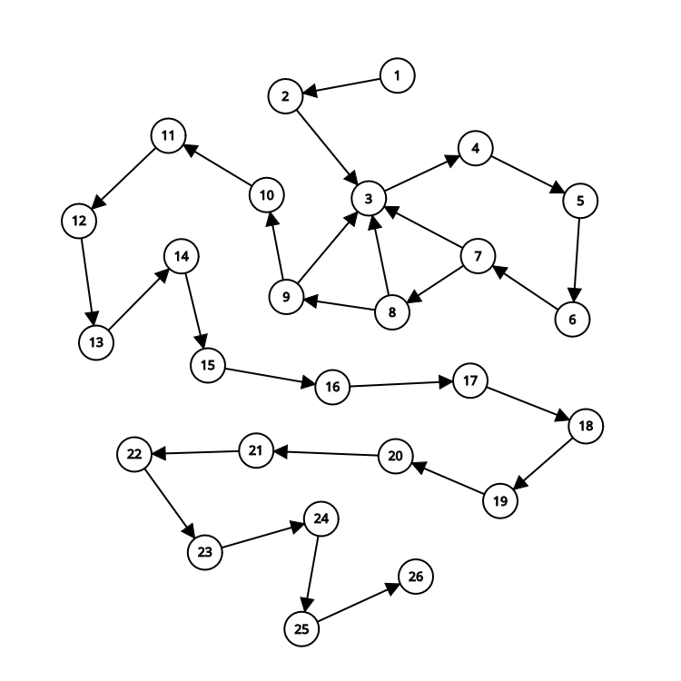

# 1. FPAA-trabalho-individual-01
Repositório do primeiro trabalho individual da disciplina de fundamentos de projeto e análise de algoritmos

### 1.1. Documentação do Repositório

Este repositório contém implementações do algoritmo de Karatsuba, que é um método eficiente para multiplicação de números grandes. O repositório está organizado em duas versões do algoritmo: uma em Python e outra em Rust. Além disso, há um script de teste (`test.sh`) que automatiza a execução dos testes para ambas as implementações.

#### 1.1.1. Estrutura do Repositório

A estrutura do repositório é a seguinte:

```
.
├── image.png
├── img
│   ├── grafo_python.png
│   └── grafo_rust.png
├── karatsuba_python
│   ├── main.py
│   ├── __pycache__
│   │   ├── main.cpython-313.pyc
│   │   └── test_karatsuba.cpython-313-pytest-8.3.4.pyc
│   ├── requirements.txt
│   ├── test_karatsuba.py
│   └── venv
│       ├── bin
│       ├── include
│       ├── lib
│       ├── lib64 -> lib
│       └── pyvenv.cfg
├── karatsuba_rust
│   ├── Cargo.lock
│   ├── Cargo.toml
│   ├── README.md
│   ├── src
│   │   └── main.rs
│   └── target
│       ├── CACHEDIR.TAG
│       └── debug
├── README.md
├── test.sh
└── Trabalho individual 1 - Valor 5 pontos.pdf
```

#### 1.1.2. Descrição dos Diretórios e Arquivos

- **`image.png`**: Uma imagem relacionada ao projeto.
- **`img/`**: Contém imagens de gráficos (`grafo_python.png` e `grafo_rust.png`) que podem ser resultados de benchmarks ou visualizações do algoritmo.
- **`karatsuba_python/`**: Contém a implementação do algoritmo de Karatsuba em Python.
  - **`main.py`**: O script principal que implementa o algoritmo.
  - **`test_karatsuba.py`**: Script de testes para o algoritmo.
  - **`requirements.txt`**: Lista de dependências necessárias para executar o código Python.
  - **`venv/`**: Diretório do ambiente virtual Python.
- **`karatsuba_rust/`**: Contém a implementação do algoritmo de Karatsuba em Rust.
  - **`Cargo.toml`**: Arquivo de configuração do projeto Rust.
  - **`src/main.rs`**: O código fonte principal do algoritmo em Rust.
  - **`target/`**: Diretório gerado pelo compilador Rust contendo os binários e arquivos intermediários.
- **`README.md`**: Documentação principal do repositório.
- **`test.sh`**: Script de shell para executar testes automatizados para ambas as implementações.
- **`Trabalho individual 1 - Valor 5 pontos.pdf`**: Documento PDF relacionado ao trabalho.

#### 1.1.3. Como Executar a Versão em Python

1. **Navegue até o diretório do Python:**
   ```bash
   cd karatsuba_python
   ```

2. **Crie e ative o ambiente virtual:**
   ```bash
   python3 -m venv venv
   source venv/bin/activate
   ```

3. **Instale as dependências:**
   ```bash
   pip install -r requirements.txt
   ```

4. **Execute o script principal:**
   ```bash
   python main.py
   ```

5. **Execute os testes:**
   ```bash
   pytest
   ```

6. **Desative o ambiente virtual quando terminar:**
   ```bash
   deactivate
   ```

#### 1.1.4. Como Executar a Versão em Rust

1. **Navegue até o diretório do Rust:**
   ```bash
   cd karatsuba_rust
   ```

2. **Compile e execute o projeto:**
   ```bash
   cargo run
   ```

3. **Execute os testes:**
   ```bash
   cargo test
   ```

#### 1.1.5. Como Executar o Script de Testes Automatizados

O script `test.sh` automatiza a execução dos testes para ambas as implementações (Python e Rust). Para executá-lo, siga os passos abaixo:

1. **Dê permissão de execução ao script (se necessário):**
   ```bash
   chmod +x test.sh
   ```

2. **Execute o script:**
   ```bash
   ./test.sh
   ```

O script irá:
- Criar e ativar um ambiente virtual Python.
- Instalar as dependências necessárias.
- Executar os testes em Python.
- Desativar o ambiente virtual.
- Executar os testes em Rust.

Se todos os testes passarem, você verá a mensagem: `"Todos os testes foram executados com sucesso!"`.

#### 1.1.6. Considerações Finais

Este repositório está organizado de forma a facilitar a execução e teste do algoritmo de Karatsuba em duas linguagens diferentes. O script `test.sh` é uma ferramenta útil para garantir que ambas as implementações estejam funcionando corretamente. Para mais detalhes sobre o algoritmo ou o projeto, consulte o arquivo `README.md` ou o documento PDF incluído no repositório.


# 2. Algoritmo de Karatsuba (Python)
> [Implementação em Rust](karatsuba_rust/README.md)

O **algoritmo de Karatsuba** é um método eficiente para multiplicar números grandes, reduzindo o número de operações necessárias em comparação com o método tradicional de multiplicação. Ele foi desenvolvido por Anatolii Alexeevitch Karatsuba em 1960 e é um exemplo clássico de **divisão e conquista**, uma técnica que divide um problema em subproblemas menores, resolve-os recursivamente e combina os resultados.

---

## 2.1. Como Funciona o Algoritmo?

O algoritmo de Karatsuba baseia-se na ideia de que a multiplicação de dois números grandes pode ser simplificada dividindo-os em partes menores e realizando operações mais simples. A seguir, descrevemos os passos principais:

1. **Divisão dos Números**:
   - Dados dois números \(x\) e \(y\), cada um é dividido em duas partes de tamanho aproximadamente igual.
   - Por exemplo, se \(x\) e \(y\) têm \(n\) dígitos, eles são divididos em:
     \[
     x = 10^m \cdot x_1 + x_0
     \]
     \[
     y = 10^m \cdot y_1 + y_0
     \]
     Onde \(m = \lfloor n/2 \rfloor\), \(x_1\) e \(y_1\) são as partes "altas", e \(x_0\) e \(y_0\) são as partes "baixas".

2. **Multiplicações Recursivas**:
   - O algoritmo realiza três multiplicações recursivas:
     \[
     z_0 = x_0 \cdot y_0
     \]
     \[
     z_1 = (x_1 + x_0) \cdot (y_1 + y_0)
     \]
     \[
     z_2 = x_1 \cdot y_1
     \]

3. **Combinação dos Resultados**:
   - O resultado final é obtido combinando as três multiplicações:
     \[
     x \cdot y = z_2 \cdot 10^{2m} + (z_1 - z_2 - z_0) \cdot 10^m + z_0
     \]

---

## 2.2. Vantagens do Algoritmo

- **Redução de Operações**:
  - O método tradicional de multiplicação requer \(O(n^2)\) operações para multiplicar dois números de \(n\) dígitos.
  - O Karatsuba reduz isso para \(O(n^{\log_2 3}) \approx O(n^{1.585})\), o que é significativamente mais eficiente para números grandes.

- **Aplicações**:
  - É amplamente utilizado em sistemas de computação que lidam com números muito grandes, como criptografia e aritmética de precisão arbitrária.

---

## 2.3. Métodos para Contar Operações

Para contar as operações no algoritmo de Karatsuba, seguimos os seguintes passos:

1. **Identificação de Operações**:
   - Cada operação básica (adição, subtração, multiplicação, divisão, etc.) é contabilizada.
   - Operações de atribuição e chamadas de função também são consideradas.

2. **Análise por Função**:
   - A função `karatsuba` é analisada linha por linha, contando as operações em cada passo.
   - Funções auxiliares, como `dividir` e `contar_digitos`, também são incluídas na contagem.

3. **Somatório**:
   - O total de operações é obtido somando as operações de todas as funções envolvidas.

---

## 2.4. Cálculo da Complexidade Ciclomática

A **complexidade ciclomática** é uma métrica que mede o número de caminhos independentes em um programa. Para calcular a complexidade ciclomática do algoritmo de Karatsuba, utilizamos a seguinte abordagem:

1. **Construção do Grafo de Controle de Fluxo**:
   - O código é representado como um grafo, onde os nós são blocos de código e as arestas são transições entre eles.
   - Por exemplo, condicionais (`if`) e loops (`while`) criam bifurcações no grafo.

2. **Aplicação da Fórmula**:
   - A complexidade ciclomática \(V(G)\) é calculada usando a fórmula:
     \[
     V(G) = E - N + 2
     \]
     Onde:
     - \(E\) = número de arestas.
     - \(N\) = número de nós.

3. **Resultado**:
   - No caso do algoritmo de Karatsuba, a complexidade ciclomática é **1**, indicando um fluxo de controle simples e direto.

---

## 2.5. Exemplo de Implementação em Python

[Algoritmo implementado em python](karatsuba_python/main.py)

## 2.6. Análise do Algoritmo de Karatsuba

### 2.6.1. Quantidade de Operações

#### 2.6.1.1. Função `karatsuba(x, y)`:
- **Total de operações:** 30 operações.

#### 2.6.1.2. Função `dividir(num, m)`:
- **Total de operações:** 7 operações.

#### 2.6.1.3. Função `max_numero_digitos(x, y)`:
- **Total de operações:** 5 operações.

#### 2.6.1.4. Função `contar_digitos(num)`:
- **Caso base (`num == 0`)**: 2 operações.
- **Caso geral**: 8 + 5 * número de dígitos.

### 2.6.2. Complexidade Ciclomática

#### 2.6.2.1. Grafo do algoritmo `karatsuba`:
- **Nós:** 12
- **Arestas:** 11
- **Complexidade ciclomática:** \(V(G) = E - N + 2 = 11 - 12 + 2 = 1\)

### 2.6.3. Grafo de Controle de Fluxo



### 2.6.4. Tabela de Operações

A tabela de operações permanece a mesma, mas agora as chamadas recursivas estão claramente representadas no grafo:

| Número | Operação                                                                 |
|--------|-------------------------------------------------------------------------|
| 1      | `if x < 10 or y < 10` (2 operações)                                     |
| 2      | `return x * y` (1 operação)                                             |
| 3      | `n = max_numero_digitos(x, y)` (1 chamada de função, 1 atribuição)      |
| 4      | `m = n // 2` (1 operação)                                               |
| 5      | `alta1, baixa1 = dividir(x, m)` (1 chamada de função, 2 atribuições)    |
| 6      | `alta2, baixa2 = dividir(y, m)` (1 chamada de função, 2 atribuições)    |
| 7      | `z0 = karatsuba(baixa1, baixa2)` (1 chamada de função, 1 atribuição)    |
| 8      | `z1 = karatsuba((baixa1 + alta1), (baixa2 + alta2))` (2 operações, 1 chamada de função, 1 atribuição) |
| 9      | `z2 = karatsuba(alta1, alta2)` (1 chamada de função, 1 atribuição)      |
| 10     | `resultado = (z2 * 10 ** (2 * m)) + ((z1 - z2 - z0) * 10 ** m) + z0` (7 operações, 1 atribuição) |
| 11     | `return resultado` (1 operação)                                         |
| 12     | `divisor = 10 ** m` (1 operação, 1 atribuição)                         |
| 13     | `alta = num // divisor` (1 operação, 1 atribuição)                     |
| 14     | `baixa = num % divisor` (1 operação, 1 atribuição)                     |
| 15     | `return alta, baixa` (1 operação)                                       |
| 16     | `x_digitos = contar_digitos(x)` (1 chamada de função, 1 atribuição)     |
| 17     | `y_digitos = contar_digitos(y)` (1 chamada de função, 1 atribuição)     |
| 18     | `return max(x_digitos, y_digitos)` (1 operação)                         |
| 19     | `if num == 0` (1 comparação)                                            |
| 20     | `return 1` (1 retorno)                                                  |
| 21     | `contagem = 0` (1 atribuição)                                           |
| 22     | `n = num` (1 atribuição)                                                |
| 23     | `while n != 0` (1 comparação)                                           |
| 24     | `n //= 10` (1 operação, 1 atribuição)                                   |
| 25     | `contagem += 1` (1 operação, 1 atribuição)                              |
| 26     | `return contagem` (1 operação de retorno)                               |
