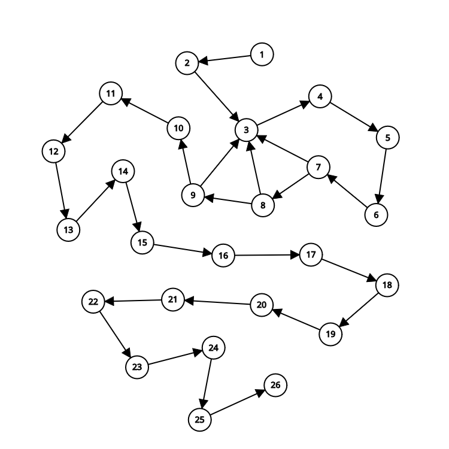

# 1. FPAA-trabalho-individual-01
Repositório do primeiro trabalho individual da disciplina de fundamentos de projeto e análise de algoritmos

# 2. Algoritmo de Karatsuba (Rust)

## 2.1. Exemplo de Implementação em Rust

[Algoritmo implementado em Rust](karatsuba_rust/main.rs)

## 2.2. Análise do Algoritmo de Karatsuba

### 2.2.1. Quantidade de Operações

#### 2.2.1.1. Função `karatsuba(x, y)`:
- **Total de operações:** 30 operações.

#### 2.2.1.2. Função `dividir(num, m)`:
- **Total de operações:** 7 operações.

#### 2.2.1.3. Função `max_numero_digitos(x, y)`:
- **Total de operações:** 5 operações.

#### 2.2.1.4. Função `contar_digitos(num)`:
- **Caso base (`num == 0`)**: 2 operações.
- **Caso geral**: 8 + 5 * número de dígitos.

### 2.2.2. Complexidade Ciclomática

#### 2.2.2.1. Grafo do algoritmo `karatsuba`:
- **Nós:** 12
- **Arestas:** 11
- **Complexidade ciclomática:** \(V(G) = E - N + 2 = 11 - 12 + 2 = 1\)

### 2.2.3. Grafo de Controle de Fluxo

### 2.2.4. Tabela de Operações

A tabela de operações detalha as chamadas de funções e atribuições feitas ao longo do algoritmo:

| Número | Operação                                                                                                                      |
| ------ | ----------------------------------------------------------------------------------------------------------------------------- |
| 1      | `if x < 10 \|\| y < 10` (2 operações)                                                                                         |
| 2      | `return x * y` (1 operação)                                                                                                   |
| 3      | `n = max_numero_digitos(x, y)` (1 chamada de função, 1 atribuição)                                                            |
| 4      | `m = n / 2` (1 operação)                                                                                                      |
| 5      | `let (alta1, baixa1) = dividir(x, m);` (1 chamada de função, 2 atribuições)                                                   |
| 6      | `let (alta2, baixa2) = dividir(y, m);` (1 chamada de função, 2 atribuições)                                                   |
| 7      | `z0 = karatsuba(baixa1, baixa2);` (1 chamada de função, 1 atribuição)                                                         |
| 8      | `z1 = karatsuba(baixa1 + alta1, baixa2 + alta2);` (2 operações, 1 chamada de função, 1 atribuição)                            |
| 9      | `z2 = karatsuba(alta1, alta2);` (1 chamada de função, 1 atribuição)                                                           |
| 10     | `resultado = (z2 * 10_usize.pow(2 * m as u32)) + ((z1 - z2 - z0) * 10_usize.pow(m as u32)) + z0;` (7 operações, 1 atribuição) |
| 11     | `return resultado;` (1 operação)                                                                                              |
| 12     | `let divisor = 10_usize.pow(m as u32);` (1 operação, 1 atribuição)                                                            |
| 13     | `let alta = num / divisor;` (1 operação, 1 atribuição)                                                                        |
| 14     | `let baixa = num % divisor;` (1 operação, 1 atribuição)                                                                       |
| 15     | `return (alta, baixa);` (1 operação)                                                                                          |
| 16     | `let x_digitos = contar_digitos(x);` (1 chamada de função, 1 atribuição)                                                      |
| 17     | `let y_digitos = contar_digitos(y);` (1 chamada de função, 1 atribuição)                                                      |
| 18     | `return max(x_digitos, y_digitos);` (1 operação)                                                                              |
| 19     | `if num == 0` (1 comparação)                                                                                                  |
| 20     | `return 1;` (1 retorno)                                                                                                       |
| 21     | `let mut contagem = 0;` (1 atribuição)                                                                                        |
| 22     | `let mut n = num.clone();` (1 atribuição)                                                                                     |
| 23     | `while n != 0` (1 comparação)                                                                                                 |
| 24     | `n /= 10;` (1 operação, 1 atribuição)                                                                                         |
| 25     | `contagem += 1;` (1 operação, 1 atribuição)                                                                                   |
| 26     | `return contagem;` (1 operação de retorno)                                                                                    |

